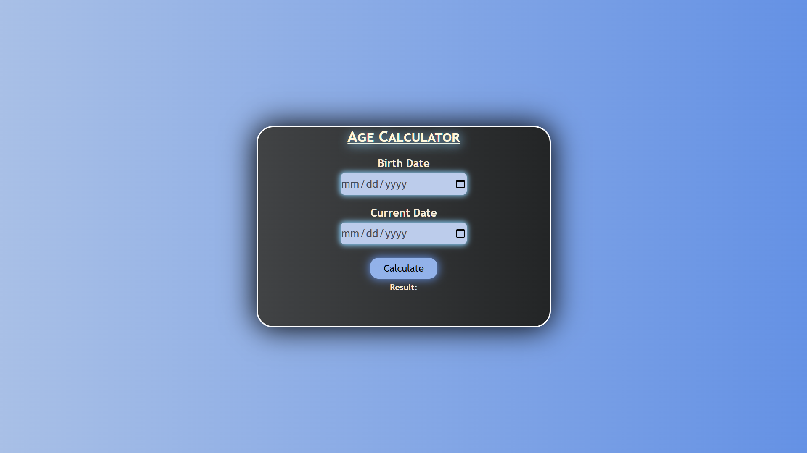

# Age Calculator

This is a simple web application that calculates the age of a person based on their birthdate and the current date. It takes two inputs: the birthdate and the current date, and calculates the person's age in years, months, and days.

---

## **Features**

- **Input Fields:** Allows the user to input their birthdate and current date.
- **Age Calculation:** Calculates and displays the age in years, months, and days.
- **Error Handling:** Alerts if the birthdate is greater than the current date.

---

## **How to Use**

1. **Enter Birth Date:**
   - Select your birth date from the input field.
2. **Enter Current Date:**
   - Select the current date from the second input field.
3. **Click "Calculate Age":**

   - Click the **"Calculate"** button to calculate your age. The result will be displayed below the button.

4. **View Result:**
   - The result will show your age in years, months, and days.
   - If the birth date is later than the current date, an error message will be shown.

---

## **Technologies Used**

- **HTML**
- **CSS**
- **JavaScript**

---

## **How It Works**

- The user inputs their birthdate and current date.
- The script compares the two dates, calculating the difference in years, months, and days.
- It displays the age in a readable format if the birthdate is valid.
- If the birthdate is in the future, an error message is displayed.

---

## **Preview Screenshot**

Here is a preview of the age calculator:

